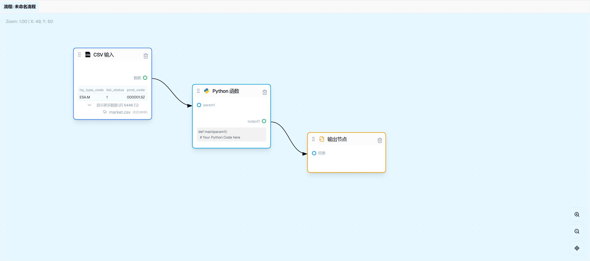
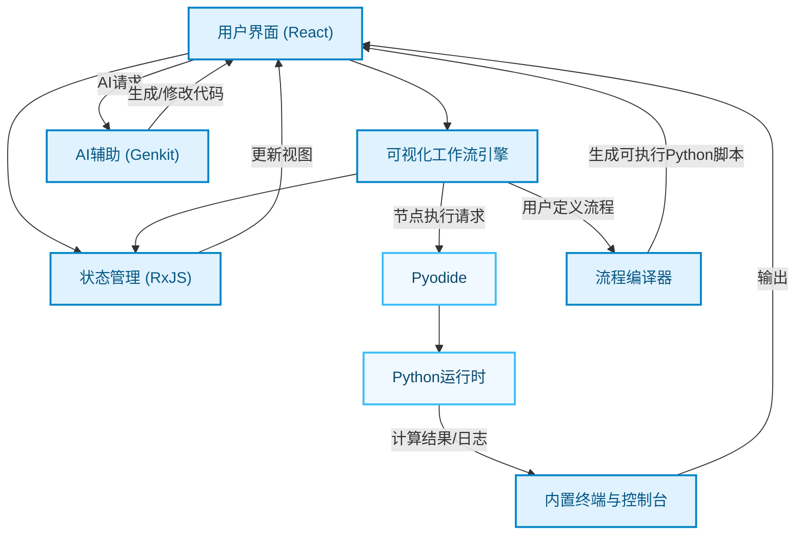
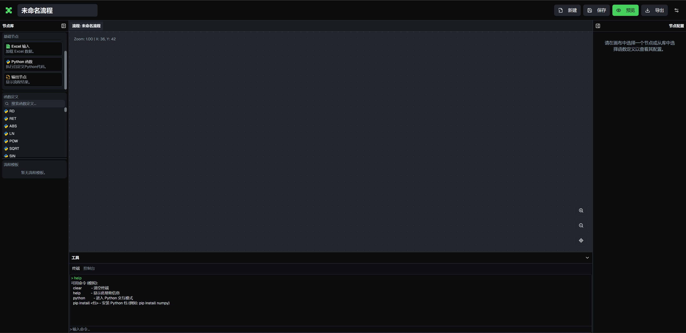
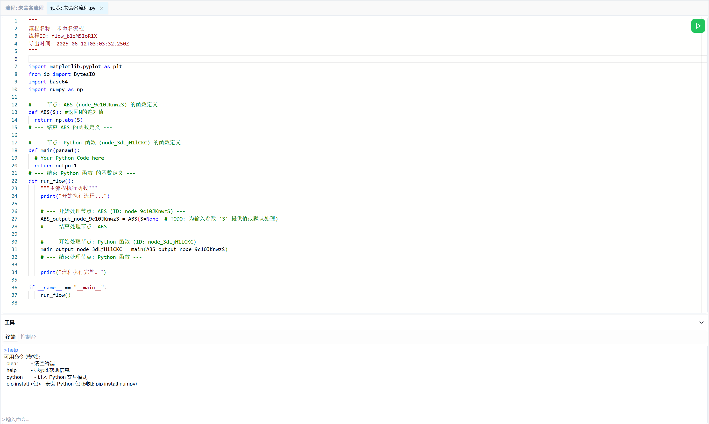
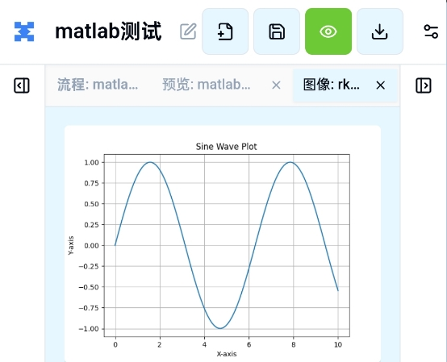
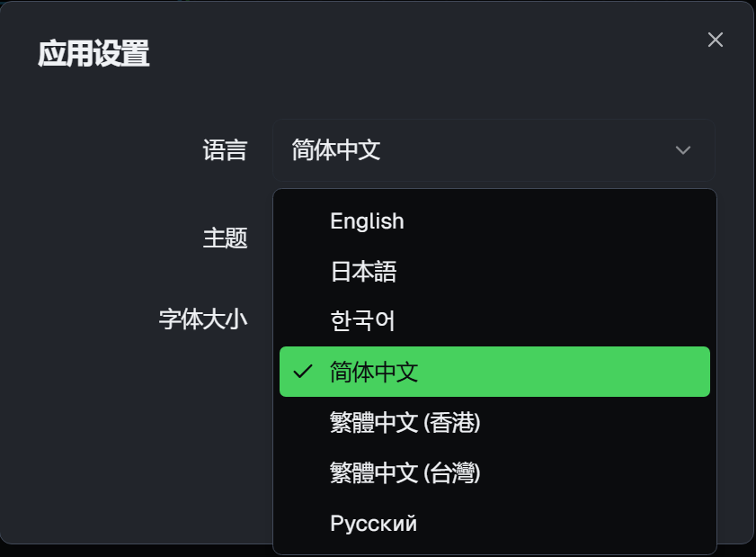

# Quant Trading Flow

<p align="center">
  
</p>

<p align="center">
  <strong>一款纯浏览器端、可视化的量化投研工作流平台，由 React 和 WebAssembly 强力驱动。</strong>
</p>

<p align="center">
    <a href="https://github.com/rurico/Quant-Trading-Flow/blob/main/LICENSE">
        
    </a>
    <a href="#">
        
    </a>
    <a href="#">
        
    </a>
    <a href="#">
        
    </a>
</p>

##  项目概述 (Overview)

**Quant Trading Flow** 旨在解决传统量化研究中**环境配置繁琐、策略迭代缓慢、流程固化**的痛点。本项目将复杂的量化研究流程抽象为一系列可拖拽的节点，通过可视化的方式，让用户在浏览器中就能完成从**数据导入、因子构建、策略回测**到**代码生成**的全过程。

这一切都**无需任何后端服务**支持。目前通过深度集成 **Pyodide (Python on WebAssembly)**，将强大的 Python 数据科学生态（Pandas, NumPy 等）直接带到浏览器中，为您提供一个开箱即用、零配置的轻量级量化实验室。


## 架构图


## 🚀 如何开始 (Getting Started)
```bash
# 1. 克隆仓库
git clone https://github.com/rurico/Quant-Trading-Flow.git

# 2. 进入项目目录
cd Quant-Trading-Flow

# 3. 安装依赖 (推荐使用 pnpm)
npm install
# 或者 yarn install / npm install

# 4. 启动开发服务器
npm run dev
```

现在，在浏览器中打开 `http://localhost:9002` 即可开始体验！

##  核心特性 (Key Features)

*   **纯前端，零后端依赖**：所有计算均在您的浏览器中完成，保证了数据的私密性与安全性。
*   **可视化工作流引擎**：通过拖拽节点和连接数据流，直观地构建和编排复杂的量化策略。支持流程的嵌套与复用，让策略模块化。
*   **浏览器内的完整Python环境**：
    * 内置 **Pyodide**，可在浏览器沙箱中运行 Python 代码。
    *   通过内置终端支持 `pip install`，动态安装 `Pandas`, `NumPy`, `MyTT` 等常用库。
    *   提供类 Jupyter 的交互式代码编辑体验。
*   **一键式代码生成与导出**：将可视化工作流一键编译为结构清晰、可直接运行的 `.py` 脚本，无缝衔接至您的生产环境。
*   **集成化开发环境**：
    *   **节点配置面板**：实时调整节点参数和代码逻辑。
    *   **内置终端**：执行 `pip` 命令或进入 Python REPL 进行快速测试。
    *   **日志控制台**：清晰展示应用日志、脚本输出及错误信息。
*   **国际化支持**：内置多语言切换，满足不同地区用户的使用习惯。


##  应用截图 (Screenshots)

<table style="width:100%; border: none;">
  <tr style="border: none;">
    <td style="text-align: center; border: none; padding: 10px;">
      <strong>主编辑器界面</strong>
      <br>
      
    </td>
    <td style="text-align: center; border: none; padding: 10px;">
      <strong>代码预览与执行</strong>
      <br>
      
    </td>
  </tr>
  <tr style="border: none;">
    <td style="text-align: center; border: none; padding: 10px;">
      <strong>MATLAB 绘图</strong>
      <br>
      
    </td>
    <td style="text-align: center; border: none; padding: 10px;">
      <strong>应用设置</strong>
      <br>
      
    </td>
  </tr>
</table>

##  技术栈 (Tech Stack)

*   **核心框架**: `React 18`, `TypeScript`
*   **核心引擎**: `Pyodide (WebAssembly)`
*   **状态管理**: `RxJS`
*   **工程化**: `Vite`, `ESLint`, `Prettier`

##  路线图 (Roadmap)

目前正在积极开发以下新功能，欢迎提出您的宝贵建议！

*   [ ] **高级图表集成**: 引入 `ECharts` 或 `Plotly.js`，以更丰富的方式可视化回测结果。
*   [ ] **数据源节点**: 增加直接从 Tushare, AkShare 等财经数据API获取数据的原生节点。
*   [ ] **性能优化**: 优化 Pyodide 的加载与执行效率，特别是在处理大规模数据集时。
*   [ ] **更强大的代码编译器**: 提升可视化流程到 Python 代码的编译能力，处理更复杂的依赖和执行逻辑。
*   [ ] **社区分享**: 建立一个平台，让用户可以分享和导入他人创建的流程模板。

##  参与贡献 (Contributing)

目前非常欢迎各种形式的贡献！如果你有任何想法、建议或发现了 Bug，请随时提交 [Issues](https://github.com/rurico/Quant-Trading-Flow/issues) 或 [Pull Requests](https://github.com/rurico/Quant-Trading-Flow/pulls)。

1.  Fork 本仓库
2.  创建您的新分支 (`git checkout -b feature/AmazingFeature`)
3.  提交您的更改 (`git commit -m 'Add some AmazingFeature'`)
4.  将您的分支推送到远程 (`git push origin feature/AmazingFeature`)
5.  提交一个 Pull Request

##  开源许可 (License)

本项目基于 [MIT License](./LICENSE) 开源。